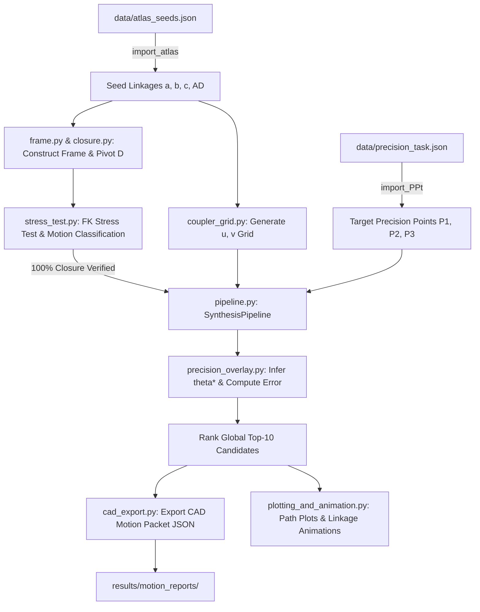
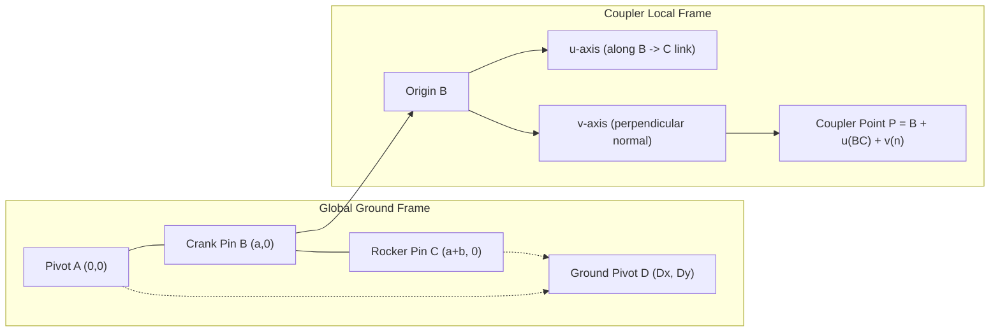

# Hrones_Altas_With_Theta_As_Output

Deterministic Planar Four-Bar Linkage Synthesis with Coupler Point Offset and Automatic $\theta^*$ Inference  
Built on the Foundation of the Hrones–Nelson Atlas (1951)

---

## Overview

[Hrones_Altas_With_Theta_As_Output](README.md) is a kinematic synthesis and simulation engine for planar four-bar linkages. Grounded in the classical **Hrones & Nelson (1951)** coupler-curve atlas, this system modernizes the methodology into a digital synthesis platform capable of **2-point** and **3-point** precision matching with arbitrary coupler point offsets $(u, v)$.

### The Core Paradigm Shift: $\theta$ as an Output

In classical linkage synthesis, designers are forced to supply or guess input crank angles ($\theta_1, \theta_2, \theta_3$) corresponding to desired precision positions. This introduces severe designer error and limits the design space. 

This engine solves this challenge by **inferring the optimal design angles $\theta^*$ directly from the geometric coupler trajectory**:

$$k_i^* = \arg\min_k \| P(\theta_k) - P_i \|^2 \implies \theta_i^* = \theta(k_i^*)$$

The user supplies only the target precision points ($P_1, P_2, P_3$). The engine determines the optimal crank angles $\theta^*$, measures the minimum squared Euclidean error, ranks the global candidates, exports CAD-ready motion packets, and generates kinematic animations.

---

## System Architecture

### Pipeline Flowchart



### Layered Architecture

```mermaid
graph TB
    subgraph Layer 1: Data Ingestion
        D1[Import_Atlas_Data.py]
        D2[Import_PPt_Data.py]
    end

    subgraph Layer 2: Geometric & Kinematic Core
        K1[frame.py]
        K2[closure.py]
        K3[fk_engine.py]
        K4[trajectory.py]
        K5[coupler_frame.py]
        K6[coupler_grid.py]
    end

    subgraph Layer 3: Validation & Classification
        V1[stress_test.py]
        V2[classification.py]
        V3[continuity_metrics.py]
    end

    subgraph Layer 4: Precision Synthesis & Optimization
        P1[precision_overlay.py]
        P2[evaluation.py]
        P3[pipeline.py]
    end

    subgraph Layer 5: Orchestration, CAD Export & Visualization
        O1[scripts/generate_universe.py]
        O2[cad_export.py]
        O3[plotting_and_animation.py]
    end

    Layer 1 --> Layer 2
    Layer 2 --> Layer 3
    Layer 3 --> Layer 4
    Layer 4 --> Layer 5
```

---

## Coordinate Frame and Coupler Definition

To guarantee deterministic consistency between Python kinematic simulations and 3D CAD modeling environments, all geometry follows strict frame normalization:



- **Base Ground Frame**: Pivot $A = (0, 0)$, Crank initial $B = (a, 0)$, Coupler initial $C = (a + b, 0)$. Ground pivot $D = (D_x, D_y)$ is deterministically computed via circle-circle intersection.
- **Coupler Local Frame**: Origin at pin $B$, $u$-axis directed along coupler link $BC$, $v$-axis normal to $BC$.
- **Crank Rotation**: Input crank rotates CCW from $0 \to 2\pi$ starting from the positive horizontal axis.

---

## Modules Supporting [scripts/generate_universe.py](scripts/generate_universe.py)

The primary execution entry point is [scripts/generate_universe.py](scripts/generate_universe.py). The supporting modules in [fourbar_synthesis/](fourbar_synthesis/) are organized by functional responsibility:

### 1. Data Ingestion
- [fourbar_synthesis/Import_Atlas_Data.py](fourbar_synthesis/Import_Atlas_Data.py): Reads seed four-bar dimensions $(a, b, c, AD)$ and metadata from [data/atlas_seeds.json](data/atlas_seeds.json).
- [fourbar_synthesis/Import_PPt_Data.py](fourbar_synthesis/Import_PPt_Data.py): Ingests 2-point or 3-point target precision tasks from [data/precision_task.json](data/precision_task.json).

### 2. Geometry & Coordinate Frames
- [fourbar_synthesis/frame.py](fourbar_synthesis/frame.py): Constructs normalized base frames $(A, B, C, D)$ ensuring reproducibility across environments.
- [fourbar_synthesis/coupler_frame.py](fourbar_synthesis/coupler_frame.py): Maps offset coupler points $(u, v)$ from local link coordinates to global spatial coordinates.
- [fourbar_synthesis/coupler_grid.py](fourbar_synthesis/coupler_grid.py): Generates dense discrete candidate grids of $(u, v)$ offsets across the coupler domain.

### 3. Kinematics & Closure
- [fourbar_synthesis/closure.py](fourbar_synthesis/closure.py): Deterministic circle-circle intersection solver and ground pivot $D$ positioning without iterative solver drift.
- [fourbar_synthesis/fk_engine.py](fourbar_synthesis/fk_engine.py): Single-step forward kinematics march maintaining continuous branch tracking.
- [fourbar_synthesis/trajectory.py](fourbar_synthesis/trajectory.py): Simulates full $0 \to 2\pi$ crank rotations and evaluates point trajectories.

### 4. Validation & Stress Testing
- [fourbar_synthesis/stress_test.py](fourbar_synthesis/stress_test.py): Runs exhaustive kinematic stress checks across 720 angle increments to verify $100\%$ closure rates and flag singularity-free mechanisms.
- [fourbar_synthesis/classification.py](fourbar_synthesis/classification.py): Grashof criteria classification (crank-rocker, double-crank, rocker-crank).
- [fourbar_synthesis/continuity_metrics.py](fourbar_synthesis/continuity_metrics.py): Monitors angular velocity smoothness and detects branch switching.

### 5. Precision Synthesis Pipeline
- [fourbar_synthesis/pipeline.py](fourbar_synthesis/pipeline.py): Orchestrates the `SynthesisPipeline` class, binding geometry, forward kinematics, precision evaluation, and export routines.
- [fourbar_synthesis/precision_overlay.py](fourbar_synthesis/precision_overlay.py): Evaluates 2-pt and 3-pt precision error, dynamically extracts inferred $\theta^*$, and computes nearest Euclidean distances.
- [fourbar_synthesis/evaluation.py](fourbar_synthesis/evaluation.py): Error metrics and candidate ranking functions.

### 6. CAD Export & Visualization
- [fourbar_synthesis/cad_export.py](fourbar_synthesis/cad_export.py): Exports full kinematic results, inferred $\theta^*$, and pivot coordinates to structured JSON CAD motion packets in [results/motion_reports/](results/motion_reports/).
- [fourbar_synthesis/plotting_and_animation.py](fourbar_synthesis/plotting_and_animation.py): Renders static coupler curve plots with precision point overlays and generates real-time Matplotlib kinematic animations.

---

## Execution Workflow

1. **Precision Task Ingestion**: Define 2 or 3 precision points in [data/precision_task.json](data/precision_task.json).
2. **Execute Universe Generator**: Run [scripts/generate_universe.py](scripts/generate_universe.py).
3. **Select Mode**: Choose 2-point or 3-point regression matching mode.
4. **Automated Search**:
   - Loops over all Hrones-Nelson seed linkages in [data/atlas_seeds.json](data/atlas_seeds.json).
   - Generates candidate $(u, v)$ coupler grids.
   - Filters by closure rate ($100\%$) and crank-rocker feasibility.
   - Incurs zero angle guessing by locating $\theta_i^* = \arg\min_\theta \|P(\theta) - P_i\|^2$.
5. **Global Top-10 Ranking**: Sorts all candidate mechanisms across all seeds by total sum-of-squares error.
6. **CAD & Visual Output**:
   - Exports JSON motion packets to [results/motion_reports/](results/motion_reports/).
   - Displays diagnostic overlay tables.
   - Renders coupler trajectory plots and interactive linkage animations.

---

## Mathematical Formulation

### 1. Geometric Closure
For input crank angle $\theta$, pin position $B$ is:

$$B(\theta) = A + a \begin{bmatrix} \cos\theta \\ \sin\theta \end{bmatrix}$$

Rocker pin $C$ is found at the circle-circle intersection of radius $b$ centered at $B(\theta)$ and radius $c$ centered at ground pivot $D$:

$$\| C - B(\theta) \| = b, \quad \| C - D \| = c$$

### 2. Coupler Point Offset
Given coupler link orientation $\phi(\theta) = \operatorname{atan2}(C_y - B_y, C_x - B_x)$, coupler point $P(\theta)$ with local offset $(u, v)$ is:

$$P(\theta) = B(\theta) + \begin{bmatrix} \cos\phi(\theta) & -\sin\phi(\theta) \\ \sin\phi(\theta) & \cos\phi(\theta) \end{bmatrix} \begin{bmatrix} u \\ v \end{bmatrix}$$

### 3. Precision Error Optimization
For target precision points $\{P_i\}_{i=1}^M$ ($M \in \{2, 3\}$):

$$E = \sum_{i=1}^M \min_{k} \| P(\theta_k) - P_i \|^2$$

$$\theta_i^* = \theta\left(\arg\min_k \| P(\theta_k) - P_i \|^2\right)$$

---

## Reference Documentation & Engineering Logs

Detailed development notes, mathematical proofs, refactoring logs, and diagnostic plots are documented in:

- **Refactor Roadmap & $\theta^*$ Theory**:
  - [docs/reason_for_fork_or_clone/Theta_concept_scope.md](docs/reason_for_fork_or_clone/Theta_concept_scope.md) — Mathematical scope of $\theta^*$ angle inference.
  - [docs/reason_for_fork_or_clone/thetas_as_output.md](docs/reason_for_fork_or_clone/thetas_as_output.md) — Design paradigm shift analysis.
  - [docs/reason_for_fork_or_clone/full_refactor_roadmap.md](docs/reason_for_fork_or_clone/full_refactor_roadmap.md) — Six-layer architecture and CAD normalization plan.
- **Atlas Development Suite & Validation**:
  - [docs/altas_dev_docs/development_suite_for_Altas_20260730.md](docs/altas_dev_docs/development_suite_for_Altas_20260730.md) — Master development roadmap and validation milestones.
  - [docs/altas_dev_docs/20260730_710pm_precision_point_overlay.md](docs/altas_dev_docs/20260730_710pm_precision_point_overlay.md) — Precision point overlay specification.
  - [docs/altas_dev_docs/Dev_Day_0_Testing.md](docs/altas_dev_docs/Dev_Day_0_Testing.md) — Forward kinematics and continuity test harness.
  - [docs/altas_dev_docs/motion_classification_report.md](docs/altas_dev_docs/motion_classification_report.md) — Mechanism mobility and motion classification reports.
  - [docs/altas_dev_docs/Singularity_Heatmap_20263007.md](docs/altas_dev_docs/Singularity_Heatmap_20263007.md) — Singularity detection and Jacobian condition tracking.
