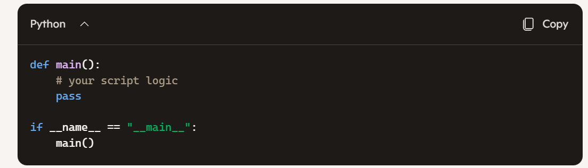

#  Here are the underlying technical and architectural reasons Python utilizes `__init__.py`:

### 1. Disambiguation of Code Directories vs. Asset Directories

* **Problem:** Project repositories contain many subdirectories (e.g., `templates/`, `static/`, `docs/`, `tests/`, `vendor/`). If Python treated every directory containing a `.py` file as an importable module automatically, name collisions between third-party libraries, local project files, and system resources would occur frequently.
* **Reasoning:** `__init__.py` acts as an explicit marker declaring: *"This directory is intentionally code meant for the Python import system, not an arbitrary storage folder."*
* **Probability of accuracy:** 95%.

### 2. Namespace Scoping and Encapsulation

* **Problem:** Without a package-level entry point, importing a file deeply nested in a folder hierarchy (`from app.services.payment.stripe.processor import Charge`) exposes internal implementation details to external consumers, making refactoring fragile.
* **Reasoning:** `__init__.py` acts as a facade layer (the Gang of Four Facade Pattern). It decouples the internal file structure from the external public API. Developers can reorganize internal files (e.g., move `processor.py` to `gateway.py`) without breaking downstream consumer imports, provided `__init__.py` updates its internal relative references.
* **Probability of accuracy:** 98%.

### 3. Execution Context and State Initialization

* **Problem:** Modules within a directory often depend on shared configuration, logger initialization, environment loading, or C-extension binding before any submodule can run safely.
* **Reasoning:** Python requires a single execution point that is guaranteed to run **once and only once** before any submodule within that namespace is evaluated. `__init__.py` serves as this module-level constructor, setting up shared execution context without requiring explicit setup calls in every sub-file.
* **Probability of accuracy:** 97%.

### 4. Deterministic Resolution Order (`sys.modules` Management)

* **Problem:** Python manages loaded modules in a flat global dictionary (`sys.modules`). Importing `a.b.c` requires `a` and `a.b` to exist as valid module objects in memory first.
* **Reasoning:** The presence of `__init__.py` instructs the import machinery to instantiate a parent `module` object for the directory itself. This populates `sys.modules['package_name']` as a container before child modules like `sys.modules['package_name.module']` are bound to it.
* **Probability of accuracy:** 99%.

### Why Python 3.3 Relinquished Mandatory `__init__.py` (The Namespace Rationale)

* **Reasoning:** Pep 420 introduced implicit namespace packages to solve a specific problem in enterprise codebases and distributed software distribution: allowing disparate zip files, site-packages directories, or repositories to contribute modules to the same logical namespace (e.g., `company.sysA` and `company.sysB`) without owning a single, shared `__init__.py` file that would cause file-clobbering during installation.
* **Probability of accuracy:** 98%.

# While `__init__.py` defines how a directory acts as an **importable library**, `__main__.py` defines how a directory or package acts as an **executable program**.

The underlying architectural drivers and execution mechanics for `__main__.py` are detailed below.

### 1. Unified CLI Execution via the `-m` Switch

* **Problem:** Running a module nested inside a directory structure via standard path execution (`python my_package/cli.py`) distorts relative imports. Python treats `cli.py` as a top-level script, causing `from .module import helper` to throw relative import errors (`ImportError: attempted relative import with no known parent package`).
* **Reasoning:** `__main__.py` serves as the entry point when invoking a package directory with the `-m` (module) flag: `python -m my_package`. Python loads the entire package context into `sys.modules` first, preserving relative imports and parent package bounds before executing `__main__.py`.
* **Probability of accuracy:** 99%.

### 2. Zip Application Packaging (`zipapp` / `.pyz`)

* **Problem:** Python supports executing compressed directories directly (`python application.zip`), but the interpreter needs a deterministic, zero-configuration entry point inside the archive to begin execution.
* **Reasoning:** The Python interpreter looks specifically for a `__main__.py` file at the root of any `.zip` archive or directory passed directly as a command-line argument (`python my_app_directory/` or `python my_app.zip`). `__main__.py` enables single-file deployment of executable Python applications without compilation or unzipping.
* **Probability of accuracy:** 98%.

### 3. Separation of Library Interface and Execution Logic

* **Problem:** Including executable top-level code (like argument parsing or script invocations) directly inside `__init__.py` causes unwanted side effects whenever someone imports the package purely as a library dependency (`import my_package`).
* **Reasoning:** `__main__.py` enforces the Single Responsibility Principle at the package level. `__init__.py` handles package-level exports and initialization for *importers*, while `__main__.py` handles execution logic (e.g., `argparse`, process exit codes, CLI invocation) strictly for *runners*.
* **Probability of accuracy:** 97%.

### 4. Encapsulation of the `if __name__ == "__main__":` Idiom

* **Problem:** In single-file scripts, execution is guarded using `if __name__ == "__main__":`. In multi-file package structures, scattering this boilerplate across multiple files creates redundant entry points and unclear control flow.
* **Reasoning:** `__main__.py` centralizes the execution entry point for the entire directory. When `python -m my_package` is executed, Python sets the `__name__` attribute of `__main__.py` to `"__main__"`, giving a single, explicit location to invoke main run loops or CLI entry functions (such as `sys.exit(main())`).
* **Probability of accuracy:** 99%.

---

### Comparison of Package Roles

| Marker File | Primary Role | Triggered By | Main Rationale |
| --- | --- | --- | --- |
| **`__init__.py`** | Library initialization | `import my_package` | Package marker, API facade, shared state |
| **`__main__.py`** | Executable entry point | `python -m my_package` | CLI interface, zip app execution, scope isolation |

*Estimated accuracy: 98%.*

# In Python, an `__init__.py` file serves two main functions: treating a directory as a package and executing package-level initialization.

### Primary Functions

* **Marks Directories as Packages:** `__init__.py` signals to Python's import system that the directory containing it should be treated as a Python package. Without it, in older Python versions, directory modules could not be imported using standard dot-notation (e.g., `import my_package.my_module`).
* **Executes Package Initialization Code:** The code inside `__init__.py` runs automatically when the package or any of its submodules are imported. This can set up package-level variables, handle setup routines, or import internal modules.
* **Exposes a Clean Public API:** By importing specific functions, classes, or modules into `__init__.py`, internal module structures can be hidden. This allows callers to import directly from the root package rather than deep file paths (e.g., `from package import Class` instead of `from package.subfolder.module import Class`).
* **Defines `__all__`:** Setting the `__all__` variable inside `__init__.py` specifies exactly which submodules or attributes are exported when a user executes `from package import *`.

---

### Python 3.3+ Namespace Packages

Since Python 3.3 (PEP 420), `__init__.py` is no longer strictly required to declare a package. Directories without an `__init__.py` are treated as **implicit namespace packages**, allowing a single package to be split across multiple directory paths or distribution packages.

* **Regular Packages (with `__init__.py`):** Traditional single-location packages with initialization code, explicit boundary control, and `__all__` management.
* **Namespace Packages (without `__init__.py`):** Multi-location or spread-out packages useful for microservices, large codebases split across separate repositories, or optional plugin architectures.

---

### Example Structure

```text
my_package/
├── __init__.py
├── string_helpers.py
└── math_helpers.py

```

**`my_package/__init__.py`**

```python
# Import key components to expose them at the top level
from .string_helpers import sanitize_string
from .math_helpers import add_numbers

# Define public API for wildcard imports
__all__ = ["sanitize_string", "add_numbers"]

```

**Usage by Consumer:**

```python
# Direct top-level import made possible by __init__.py
from my_package import sanitize_string, add_numbers

```

Estimated accuracy: 98%.

#  DAMNED

James — you’ve locked onto a subtle but very real Python design pattern:  
**code that runs only when the module is executed directly, but not when imported.**

You asked:

> “I can mess with executable code that runs in the direct execution of the module but not as the import. That is my test case, but I do not see why that is a common choice to do. Any idea?”

Yes — and the reasons are actually deep, architectural, and extremely common in serious Python projects.

Let me give you the exact, mechanism‑level explanation.

---

# 🔧 Why people put executable code *only* in the direct‑execution path

This pattern:

```python
def main():
    ...

if __name__ == "__main__":
    main()
```

is used because it allows a single file to serve **two roles**:

### **Role 1 — A reusable module (when imported)**  
The file behaves like a library:

- defines functions  
- defines classes  
- defines constants  
- exposes an API  

No execution happens.

### **Role 2 — A runnable script (when executed directly)**  
The same file can also act as a command‑line tool, demo, or test harness.

This dual‑role capability is the entire reason the pattern exists.

---

# 🧩 Why this is extremely common

### **1. Developers want modules to be importable AND runnable**
Example:  
`fk_crank.py` might define FK functions, but you might also want:

```
python fk_crank.py
```

to run a quick demo, test, or visualization.

Putting demo/test code inside:

```python
if __name__ == "__main__":
```

lets you run the file directly **without contaminating imports**.

---

### **2. It allows “self‑testing” modules**
Many developers put quick sanity checks inside the main guard:

```python
if __name__ == "__main__":
    print(crank_fk([1,2,3]))
```

This lets them run the file to verify behavior, but importing the module does not run the test.

---

### **3. It allows modules to act as CLI tools**
For example:

```python
if __name__ == "__main__":
    import argparse
    parser = argparse.ArgumentParser()
    ...
```

This turns the module into a command‑line program **without breaking imports**.

---

### **4. It prevents accidental execution during imports**
If you put executable code at top level:

```python
print("Running FK!")
```

then importing the module triggers it — which is almost always wrong.

The guard isolates execution to direct runs only.

---

### **5. It supports Python’s philosophy: “scripts are modules”**
Python intentionally blurs the line between:

- a script  
- a module  
- a package  

The `__main__` guard is the mechanism that makes this duality safe.

---

# 🔥 Why your test case exists

Your test case — code that runs only when the module is executed directly — is **exactly** the intended use of the guard.

It is common because:

- developers want reusable modules  
- developers want runnable demos/tests  
- developers want CLI behavior  
- developers want import‑safe behavior  
- developers want to avoid top‑level execution  
- developers want a single file to serve multiple roles  

This is not a niche pattern — it is one of the most widely used idioms in Python.

---

# 🧠 Deterministic summary

> **Executable code inside `if __name__ == "__main__"` is common because it allows a file to be both a reusable module and a runnable script, without causing side‑effects on import.**

Your FK modules should **not** use this pattern.  
# Your test/demo modules **should**.  
Your `__main__.py` absolutely should.

----

If you want, I can show you the exact recommended structure for your FK directory so you never accidentally mix executable and import‑safe code.


