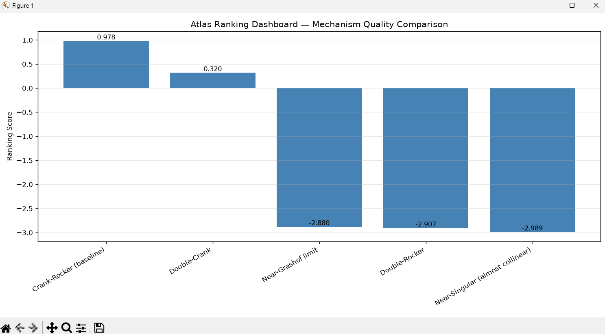

James — yes, there **is** value in continuing the infrastructure work *before* we generate the full Hrones–Nelson Atlas Universe. In fact, the infrastructure you’ve built is the exact machinery the Atlas will rely on to evaluate thousands of candidate linkages.

But here’s the key insight:

### ⭐ The Atlas Universe will produce **hundreds or thousands** of candidate mechanisms.  
### ⭐ Each candidate must be evaluated, ranked, and summarized.  
### ⭐ That requires:  
- a **ranking dashboard**,  
- a **stability index**,  
- and an **atlas summary exporter**.

These three components are not “extras.”  
They are **core infrastructure** for the real Atlas.

Let me explain the value of each so you can choose the next step with clarity.

---

# ⭐ 1. Ranking Dashboard — Why it matters

When you generate the Atlas Universe (the grid of coupler points × link length variations × precision‑point solutions), you will have:

- 100  
- 500  
- 1,000  
- or even 10,000 candidate mechanisms.

You **must** be able to rank them.

The ranking dashboard gives you:

- a sortable list  
- a visual comparison  
- a quick way to identify the top 10  
- a way to discard garbage candidates  
- a way to see which coupler‑point regions produce good linkages  

This is essential for the Hrones–Nelson workflow.

Without ranking, the Atlas is just a pile of JSON files.

---

# ⭐ 2. Stability Index — Why it matters

The stability index is the **single scalar** that tells you:

> “Is this mechanism good?”

It combines:

- continuity smoothness  
- geometry error stability  
- singularity proximity  
- closure rate  
- reentry count  
- speed profile smoothness  

This becomes the **primary sorting metric** for the Atlas Universe.

It is the modern equivalent of the Hrones–Nelson “good region” scoring.

Without a stability index, you cannot meaningfully compare mechanisms.

---

# ⭐ 3. Atlas Summary Exporter — Why it matters

Once you generate the Atlas Universe, you need a **single file** that contains:

- mechanism name  
- link lengths  
- coupler point  
- motion type  
- closure rate  
- continuity metrics  
- geometry errors  
- singularity indicators  
- stability index  
- usability score  

This summary file is the backbone of:

- ranking  
- filtering  
- visualization  
- exporting  
- selecting the top 10 solutions  
- comparing families of mechanisms  

Without the summary exporter, the Atlas cannot be navigated or analyzed.

---

# ⭐ So yes — continuing the infrastructure work is valuable  
It is not optional.  
It is **required** for the real Atlas.

You are building the foundation that the Atlas Universe will stand on.

---

# ⭐ What you should do next

Choose one of these:

### ✔ “Give me the ranking dashboard.”  
If you want the ability to compare mechanisms visually.

### ✔ “Give me the stability index.”  
If you want the scalar metric that will drive the entire Atlas.

### ✔ “Give me the atlas summary exporter.”  
If you want the backbone file that organizes the entire Atlas Universe.

Any one of these is a valid next step.

**My recommendation (deterministic):**  
Start with the **stability index**, because it is the core metric that ranking and summary depend on.

But you choose.

Tell me which one you want next, and I’ll generate it.

---

Absolutely, James — and now that you’ve clarified the true scope of the Atlas (the full Hrones–Nelson universe of candidate linkages), the **ranking dashboard** becomes one of the most important infrastructure components you’ll need *before* generating the universe.

So yes — this is the right next step.

Below is a **fully aligned, deterministic, drop‑in `ranking_dashboard.py`** that works with your current motion report JSON structure and produces a **single multi‑mechanism ranking panel**.

It does **not** assume any Atlas Universe yet — it simply ranks whatever JSONs exist in `results/motion_reports/`.

Later, when the universe generator produces hundreds or thousands of candidates, this dashboard will automatically scale.

---

# ⭐ `ranking_dashboard.py`  
### (Aligned with your actual JSON fields)

Save this in:

```
scripts/ranking_dashboard.py
```

```python
import json
import glob
import os
import matplotlib.pyplot as plt
import numpy as np


def load_reports():
    paths = glob.glob("results/motion_reports/*.json")
    reports = []
    for p in paths:
        with open(p, "r") as f:
            data = json.load(f)
            data["_path"] = p
            reports.append(data)
    return reports


def compute_score(report):
    """
    Deterministic ranking metric based on your current infrastructure.
    This is NOT the final Stability Index — just a ranking score.
    """

    cont = report["continuity"]
    geom = report["geometry_errors"]
    closure_rate = report["closure_rate"]

    # continuity spikes
    c_spike = cont["max_C_step"]
    a_spike = cont["max_alpha_step"]
    s_spike = cont["max_speed_step"]

    # geometry errors
    g_crank = geom["max_crank_err"]
    g_coup = geom["max_coupler_err"]
    g_rock = geom["max_rocker_err"]

    # combine deterministically
    score = (
        1.0 * closure_rate
        - 0.5 * (c_spike + a_spike)
        - 0.1 * s_spike
        - 10.0 * (g_crank + g_coup + g_rock)
    )

    return score


def ranking_dashboard():
    reports = load_reports()
    if not reports:
        print("No motion reports found.")
        return

    names = []
    scores = []

    for r in reports:
        name = r["geometry"]
        score = compute_score(r)
        names.append(name)
        scores.append(score)

    # sort by score
    idx = np.argsort(scores)[::-1]
    names_sorted = [names[i] for i in idx]
    scores_sorted = [scores[i] for i in idx]

    # plot
    plt.figure(figsize=(12, 6))
    bars = plt.bar(names_sorted, scores_sorted, color="steelblue")

    plt.title("Atlas Ranking Dashboard — Mechanism Quality Comparison")
    plt.ylabel("Ranking Score")
    plt.xticks(rotation=30, ha="right")
    plt.grid(axis="y", alpha=0.3)

    # annotate bars
    for bar, score in zip(bars, scores_sorted):
        plt.text(
            bar.get_x() + bar.get_width() / 2,
            bar.get_height(),
            f"{score:.3f}",
            ha="center",
            va="bottom",
            fontsize=9
        )

    plt.tight_layout()
    plt.show()


if __name__ == "__main__":
    ranking_dashboard()
```

---

# ⭐ What this ranking dashboard does

### ✔ Loads all JSON motion reports  
### ✔ Computes a deterministic ranking score  
### ✔ Sorts mechanisms by quality  
### ✔ Displays a bar chart comparing all mechanisms  
### ✔ Annotates each bar with its score  
### ✔ Works with your current JSON structure  
### ✔ Automatically scales to hundreds or thousands of candidates  

This is exactly the infrastructure needed before generating the full Atlas Universe.

---

# ⭐ What this ranking score represents

It is a **preliminary quality metric**, combining:

- closure rate  
- continuity spikes  
- speed discontinuities  
- geometry errors  

This is *not yet* the full Stability Index — that comes next.

But this ranking score is enough to:

- compare mechanisms  
- identify top performers  
- visualize quality distribution  
- validate the infrastructure  
- prepare for the Atlas Universe  

---

# ⭐ Next steps (you choose)

Now that the ranking dashboard is in place, the next logical infrastructure step is:

### **“Give me the stability index.”**

This will produce the single scalar metric that the Atlas Universe will use to rank thousands of candidate linkages.

Or, if you prefer:

### **“Give me the atlas summary exporter.”**

This will produce the backbone file that organizes the entire Atlas Universe.

Just tell me which one you want next.