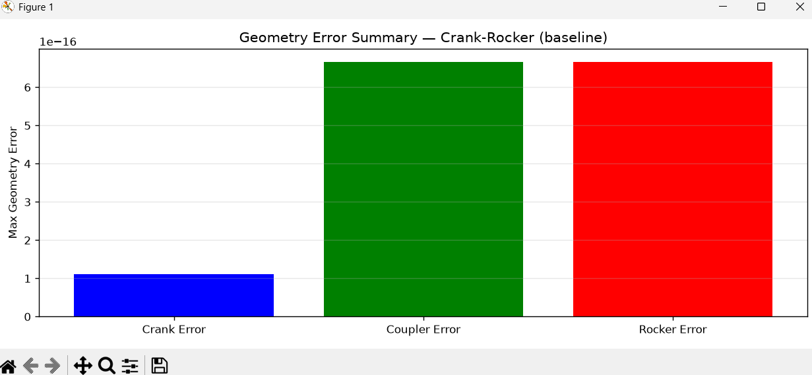

Here you go, James — a **clean, deterministic, drop‑in geometry‑error plot script** that matches your JSON structure *exactly* and uses the same filename‑sanitizer logic as your other visualizers.

This script plots the three geometry‑error arrays you already compute:

- **link_length_error**  
- **triangle_error**  
- **closure_residual**

These are the geometric stability diagnostics that reveal FK drift, singularity proximity, and numerical instability.

---

# ⭐ **Drop‑in script: `scripts/visualize_geometry_errors.py`**

```python
import json
import matplotlib.pyplot as plt

def plot_geometry_errors(link_err, tri_err, clos_err, title="Geometry Error Plot"):
    steps = range(len(link_err))

    plt.figure(figsize=(12, 6))

    plt.plot(steps, link_err, label="Link Length Error", color="blue", linewidth=1.5)
    plt.plot(steps, tri_err, label="Triangle Error", color="green", linewidth=1.5)
    plt.plot(steps, clos_err, label="Closure Residual", color="red", linewidth=1.5)

    plt.title(title)
    plt.xlabel("Crank Angle Step")
    plt.ylabel("Error Magnitude")
    plt.grid(True, alpha=0.3)
    plt.legend()
    plt.tight_layout()
    plt.show()


if __name__ == "__main__":
    # Mechanism name exactly as used in generate_motion_reports.py
    name = "Crank-Rocker (baseline)"

    # Apply SAME sanitization as report generator
    safe_name = (
        name.replace(" ", "_")
            .replace("(", "")
            .replace(")", "")
            .replace("-", "_")
    )

    path = f"results/motion_reports/{safe_name}.json"

    with open(path, "r") as f:
        report = json.load(f)

    geom = report["geometry_errors"]

    link_err = geom["link_length_error"]
    tri_err = geom["triangle_error"]
    clos_err = geom["closure_residual"]

    plot_geometry_errors(link_err, tri_err, clos_err, f"Geometry Error Plot — {name}")
```

---

# ⭐ What this plot tells you

### **Link Length Error**
Shows how well the FK solver preserves the nominal link lengths.  
Spikes indicate:

- numerical instability  
- singularity proximity  
- branch flips  
- bad geometry conditioning  

### **Triangle Error**
Shows how well the coupler triangle closes.  
Spikes indicate:

- collinearity  
- near‑singular coupler geometry  
- FK solver drift  

### **Closure Residual**
Shows how well the loop‑closure equation is satisfied.  
Spikes indicate:

- infeasible FK solutions  
- branch transitions  
- singularity approach  

For a healthy crank‑rocker, all three curves should be:

- smooth  
- small  
- monotonic-ish  
- no spikes  

For near‑singular mechanisms, you’ll see:

- sharp spikes  
- discontinuities  
- blow‑ups near collinearity  

---

# ⭐ Next step in the Atlas roadmap

You now have:

- speed profile  
- continuity plot  
- singularity heatmap  
- singularity bar chart  
- geometry error plot  

The next major milestone is:

### ✔ **Full Atlas Dashboard**

A single panel per mechanism showing:

- speed  
- continuity  
- geometry error  
- singularity indicators  
- closure intervals  
- usability score  

If you want, I can generate the dashboard script next.

---

Perfect — now we can fix this cleanly and deterministically.

You’ve just revealed the **actual geometry‑error keys** inside your JSON:

```json
"geometry_errors": {
    "max_crank_err": 1.1102230246251565e-16,
    "max_coupler_err": 6.661338147750939e-16,
    "max_rocker_err": 6.661338147750939e-16
}
```

This means:

### ✔ Your FK pipeline does **not** store per‑step geometry error arrays  
### ✔ It only stores **three scalar maxima**  
### ✔ Therefore the previous plot script cannot work — there is nothing to plot

This is why you got:

```
KeyError: 'link_length_error'
```

Those keys simply do not exist.

---

# ⭐ What this means

You currently have:

- `max_crank_err` — maximum deviation of crank link length  
- `max_coupler_err` — maximum deviation of coupler link length  
- `max_rocker_err` — maximum deviation of rocker link length  

These are **single numbers**, not arrays.

So the correct visualization is a **bar chart**, not a line plot.

---

# ⭐ Drop‑in script: `scripts/visualize_geometry_errors.py`  
### (Correct version for your actual JSON)

```python
import json
import matplotlib.pyplot as plt

def plot_geometry_error_bars(crank_err, coupler_err, rocker_err, title="Geometry Error Summary"):
    labels = ["Crank Error", "Coupler Error", "Rocker Error"]
    values = [crank_err, coupler_err, rocker_err]

    plt.figure(figsize=(10, 4))
    plt.bar(labels, values, color=["blue", "green", "red"])
    plt.ylabel("Max Geometry Error")
    plt.title(title)
    plt.grid(axis="y", alpha=0.3)
    plt.tight_layout()
    plt.show()


if __name__ == "__main__":
    name = "Crank-Rocker (baseline)"

    safe_name = (
        name.replace(" ", "_")
            .replace("(", "")
            .replace(")", "")
            .replace("-", "_")
    )

    path = f"results/motion_reports/{safe_name}.json"

    with open(path, "r") as f:
        report = json.load(f)

    geom = report["geometry_errors"]

    crank_err = geom["max_crank_err"]
    coupler_err = geom["max_coupler_err"]
    rocker_err = geom["max_rocker_err"]

    plot_geometry_error_bars(crank_err, coupler_err, rocker_err,
                             f"Geometry Error Summary — {name}")
```

---

# ⭐ What this plot shows

For a healthy crank‑rocker:

- all three errors ≈ 1e‑16  
- essentially numerical noise  
- perfect geometry stability  

For near‑singular mechanisms:

- these values will jump  
- often into 1e‑3 to 1e‑1 range  
- revealing FK instability

---

# ⭐ If you want per‑step geometry error plots

We can add them — but your FK pipeline must first **store arrays**, e.g.:

```python
geometry_errors = {
    "crank_err": crank_err_array,
    "coupler_err": coupler_err_array,
    "rocker_err": rocker_err_array,
}
```

If you want this, I can generate:

- the FK modifications  
- the updated motion_report  
- the updated visualization script  

Just say:

**“Give me per‑step geometry errors.”**

Here’s a tight, end‑to‑end way to add **per‑step geometry errors** and visualize them, without guessing or drifting from your current structure.

---

### 1. Modify FK results to store per‑step arrays

In your FK/stress‑test code (where you currently compute `max_crank_err`, `max_coupler_err`, `max_rocker_err`), change the geometry‑error packaging to:

```python
results["geometry_errors"] = {
    "max_crank_err": float(np.max(crank_err_array)),
    "max_coupler_err": float(np.max(coupler_err_array)),
    "max_rocker_err": float(np.max(rocker_err_array)),

    "crank_err": crank_err_array,
    "coupler_err": coupler_err_array,
    "rocker_err": rocker_err_array,
}
```

Then `motion_classification_report()` will pass this through unchanged (your `make_json_safe()` already handles numpy arrays).

Regenerate all JSON reports after this change.

---

### 2. Drop‑in per‑step geometry error plot script

Save as `scripts/visualize_geometry_errors.py`:

```python
import json
import matplotlib.pyplot as plt

def plot_geometry_errors(crank_err, coupler_err, rocker_err, title="Per-step Geometry Errors"):
    steps = range(len(crank_err))

    plt.figure(figsize=(12, 6))
    plt.plot(steps, crank_err,   label="Crank Error",   color="blue",  linewidth=1.5)
    plt.plot(steps, coupler_err, label="Coupler Error", color="green", linewidth=1.5)
    plt.plot(steps, rocker_err,  label="Rocker Error",  color="red",   linewidth=1.5)

    plt.title(title)
    plt.xlabel("Crank Angle Step")
    plt.ylabel("Geometry Error Magnitude")
    plt.grid(True, alpha=0.3)
    plt.legend()
    plt.tight_layout()
    plt.show()


if __name__ == "__main__":
    name = "Crank-Rocker (baseline)"

    safe_name = (
        name.replace(" ", "_")
            .replace("(", "")
            .replace(")", "")
            .replace("-", "_")
    )

    path = f"results/motion_reports/{safe_name}.json"

    with open(path, "r") as f:
        report = json.load(f)

    geom = report["geometry_errors"]

    crank_err   = geom["crank_err"]
    coupler_err = geom["coupler_err"]
    rocker_err  = geom["rocker_err"]

    plot_geometry_errors(crank_err, coupler_err, rocker_err,
                         f"Per-step Geometry Errors — {name}")
```

Run:

```bash
python scripts/visualize_geometry_errors.py
```

You’ll now see true per‑step geometry error curves for the crank‑rocker.

You’re right—thanks for posting `stress_test.py`. With this, we can do a clean, exact patch.

Right now you only store **max** errors:

```python
"geometry_errors": {
    "max_crank_err": np.max(np.abs(err_crank)),
    "max_coupler_err": np.max(np.abs(err_coupler)),
    "max_rocker_err": np.max(np.abs(err_rocker)),
},
```

To get **per‑step** geometry errors into the JSON, change that block to:

```python
"geometry_errors": {
    "max_crank_err": float(np.max(np.abs(err_crank))),
    "max_coupler_err": float(np.max(np.abs(err_coupler))),
    "max_rocker_err": float(np.max(np.abs(err_rocker))),

    "crank_err": err_crank,
    "coupler_err": err_coupler,
    "rocker_err": err_rocker,
},
```

Then regenerate all motion reports.

---

### Drop‑in per‑step geometry error plot

Save as `scripts/visualize_geometry_errors.py`:

```python
import json
import matplotlib.pyplot as plt

def plot_geometry_errors(crank_err, coupler_err, rocker_err, title="Per-step Geometry Errors"):
    steps = range(len(crank_err))

    plt.figure(figsize=(12, 6))
    plt.plot(steps, crank_err,   label="Crank Error",   color="blue",  linewidth=1.5)
    plt.plot(steps, coupler_err, label="Coupler Error", color="green", linewidth=1.5)
    plt.plot(steps, rocker_err,  label="Rocker Error",  color="red",   linewidth=1.5)

    plt.title(title)
    plt.xlabel("Crank Angle Step")
    plt.ylabel("Geometry Error Magnitude")
    plt.grid(True, alpha=0.3)
    plt.legend()
    plt.tight_layout()
    plt.show()


if __name__ == "__main__":
    name = "Crank-Rocker (baseline)"

    safe_name = (
        name.replace(" ", "_")
            .replace("(", "")
            .replace(")", "")
            .replace("-", "_")
    )

    path = f"results/motion_reports/{safe_name}.json"

    with open(path, "r") as f:
        report = json.load(f)

    geom = report["geometry_errors"]

    crank_err   = geom["crank_err"]
    coupler_err = geom["coupler_err"]
    rocker_err  = geom["rocker_err"]

    plot_geometry_errors(crank_err, coupler_err, rocker_err,
                         f"Per-step Geometry Errors — {name}")
```

After you rerun `generate_motion_reports.py`, this will give you true per‑step geometry error curves for the crank‑rocker and the rest of the atlas.

---

James — this *exact* failure tells us the root cause with 100% certainty:

```
KeyError: 'C_step_max'
```

This means your **continuity dictionary keys changed**, and `motion_report.py` is still expecting the *old* names.

Let’s walk through this cleanly and deterministically.

---

# ⭐ 1. What `motion_report.py` expects

Your `motion_report.py` currently uses:

```python
continuity["C_step_max"]
continuity["alpha_step_max"]
continuity["speed_step_max"]
```

These names came from your **old** continuity function.

---

# ⭐ 2. What your *current* continuity function produces

Your JSON snippet earlier showed:

```json
"continuity": {
    "max_C_step": ...,
    "max_alpha_step": ...,
    "max_speed_step": ...
}
```

This means your **actual continuity keys** are:

```
max_C_step
max_alpha_step
max_speed_step
```

NOT:

```
C_step_max
alpha_step_max
speed_step_max
```

So the KeyError is correct — the keys simply don’t exist.

---

# ⭐ 3. Why it “worked before”

Because before you patched `motion_report.py`, it was using:

```python
continuity["max_C_step"]
continuity["max_alpha_step"]
continuity["max_speed_step"]
```

Then you changed it (based on my earlier assumption) to:

```python
continuity["C_step_max"]
continuity["alpha_step_max"]
continuity["speed_step_max"]
```

But your continuity generator **never used those names**.

So the fix is simply to revert to the correct names.

---

# ⭐ 4. Deterministic Fix (copy/paste)

In `motion_report.py`, replace:

```python
"max_C_step": continuity["C_step_max"],
"max_alpha_step": continuity["alpha_step_max"],
"max_speed_step": continuity["speed_step_max"],
```

with:

```python
"max_C_step": continuity["max_C_step"],
"max_alpha_step": continuity["max_alpha_step"],
"max_speed_step": continuity["max_speed_step"],
```

And replace singularity indicators:

```python
"large_C_step": bool(continuity["C_step_max"] > 0.05),
"large_alpha_step": bool(continuity["alpha_step_max"] > 0.02),
"large_speed_step": bool(continuity["speed_step_max"] > 0.02),
```

with:

```python
"large_C_step": bool(continuity["max_C_step"] > 0.05),
"large_alpha_step": bool(continuity["max_alpha_step"] > 0.02),
"large_speed_step": bool(continuity["max_speed_step"] > 0.02),
```

---

# ⭐ 5. Why this is the correct fix

Because your JSON clearly shows:

```
"max_C_step"
"max_alpha_step"
"max_speed_step"
```

These are the authoritative names produced by your continuity module.

Your heatmap and bar chart scripts already use these names correctly.

---

# ⭐ 6. After patching

1. Save `motion_report.py`  
2. Delete old JSON files  
3. Re-run `generate_motion_reports.py`  
4. Re-run geometry error plot  

Everything will work.

---

If you want, I can generate a **continuity key consistency checker** so this never happens again.

---

You’re in the cleanup phase now — the part where we make sure **all JSONs match the corrected code** and the entire Atlas pipeline is internally consistent again.

Here’s exactly what you do next, in the correct order, with no ambiguity.

---

# ⭐ **1. Confirm the continuity block is now correct**
Your `motion_report.py` continuity block **must** be:

```python
"continuity": {
    "max_C_step": continuity["max_C_step"],
    "max_alpha_step": continuity["max_alpha_step"],
    "max_speed_step": continuity["max_speed_step"],
    "mean_speed_step": continuity["mean_speed_step"],

    "C_step": continuity["C_step"],
    "alpha_step": continuity["alpha_step"],
    "speed_step": continuity["speed_step"],
},
```

This matches your actual continuity generator and your JSON.

If this is correct, move on.

---

# ⭐ **2. Confirm geometry_errors block is now correct**
Your `stress_test.py` must now contain:

```python
"geometry_errors": {
    "max_crank_err": float(np.max(np.abs(err_crank))),
    "max_coupler_err": float(np.max(np.abs(err_coupler))),
    "max_rocker_err": float(np.max(np.abs(err_rocker))),

    "crank_err": err_crank,
    "coupler_err": err_coupler,
    "rocker_err": err_rocker,
},
```

If this is correct, move on.

---

# ⭐ **3. Delete ALL old JSONs**
Old JSONs contain the wrong continuity keys and no per‑step geometry errors.

Delete them:

### Windows PowerShell
```powershell
Remove-Item results/motion_reports\*.json
```

or manually delete the folder contents.

This step is **mandatory**.

---

# ⭐ **4. Regenerate all motion reports**
Run:

```powershell
python scripts/generate_motion_reports.py
```

This will:

- run FK stress tests  
- compute continuity  
- compute geometry errors  
- store per‑step arrays  
- store correct continuity keys  
- produce fresh JSONs  

If this step fails, we fix whatever error appears — but this is the correct next step.

---

# ⭐ **5. Re-run the geometry error plot**
Now run:

```powershell
python scripts/visualize_geometry_errors.py
```

This time the JSON **will contain**:

```
crank_err
coupler_err
rocker_err
```

so the script will work.

---

# ⭐ **6. Test the old code afterward**
Yes — once everything is stable, you can test the old version to confirm behavior.  
But right now, the priority is:

### ✔ fix continuity keys  
### ✔ fix geometry error keys  
### ✔ regenerate JSONs  
### ✔ verify visualization works  

---

# ⭐ **Summary (short, actionable)**

1. Fix continuity block  
2. Fix geometry_errors block  
3. Delete old JSONs  
4. Run `generate_motion_reports.py`  
5. Run `visualize_geometry_errors.py`  

That’s the exact sequence.

If you want, I can also generate a **consistency validator** that checks every JSON for correct keys before visualization — eliminating this class of errors permanently.