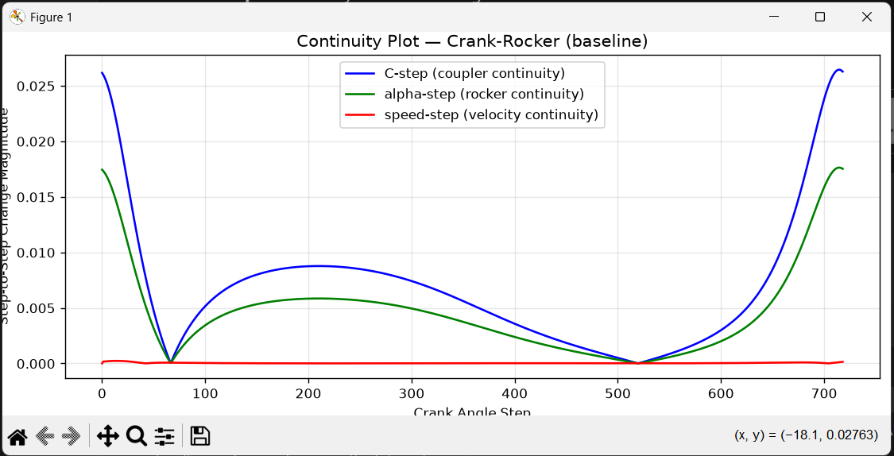

Great — continuity plots are the *other half* of motion quality.  
Speed profile shows **dynamic smoothness**, but continuity plots show **geometric smoothness** of the FK manifold itself.

Below is a **full, clean, cut‑and‑paste continuity plot script**, matching your project structure and using the same filename‑sanitizer logic you now use everywhere.

It produces **three curves**:

- **C‑step** — continuity of the coupler point  
- **α‑step** — continuity of the rocker angle  
- **speed‑step** — continuity of the coupler velocity  

These are exactly the values your FK pipeline computes in `compute_continuity_metrics()`.

---

# ⭐ Full replacement: `scripts/visualize_continuity.py`

```python
import json
import matplotlib.pyplot as plt

def plot_continuity(C_step, alpha_step, speed_step, title="Continuity Plot"):
    steps = range(len(C_step))

    plt.figure(figsize=(12, 6))

    # Coupler point continuity
    plt.plot(steps, C_step, label="C-step (coupler continuity)", color="blue", linewidth=1.5)

    # Rocker angle continuity
    plt.plot(steps, alpha_step, label="alpha-step (rocker continuity)", color="green", linewidth=1.5)

    # Speed continuity
    plt.plot(steps, speed_step, label="speed-step (velocity continuity)", color="red", linewidth=1.5)

    plt.title(title)
    plt.xlabel("Crank Angle Step")
    plt.ylabel("Step-to-Step Change Magnitude")
    plt.grid(True, alpha=0.3)
    plt.legend()
    plt.tight_layout()
    plt.show()


if __name__ == "__main__":
    # Mechanism name exactly as used in generate_motion_reports.py
    name = "Crank-Rocker (baseline)"

    # Apply SAME sanitization as report generator
    safe_name = (
        name.replace(" ", "_")
            .replace("(", "")
            .replace(")", "")
            .replace("-", "_")
    )

    path = f"results/motion_reports/{safe_name}.json"

    with open(path, "r") as f:
        report = json.load(f)

    continuity = report["continuity"]

    C_step = continuity["C_step"]
    alpha_step = continuity["alpha_step"]
    speed_step = continuity["speed_step"]

    plot_continuity(C_step, alpha_step, speed_step, f"Continuity Plot — {name}")
```

---

# ⭐ What this plot reveals

### **Crank‑Rocker (baseline)**
- all three curves smooth  
- no spikes  
- no discontinuities  
- no branch flips  
- no singularity approach  

### **Near‑Grashof limit**
- α‑step spikes near collinearity  
- speed‑step spikes near branch transitions  
- C‑step shows geometric instability  

### **Double‑Rocker**
- two smooth regions  
- discontinuity between them  
- speed‑step spike at branch flip  

### **Near‑Singular**
- massive α‑step spikes  
- C‑step blow‑ups  
- speed‑step vertical walls  

This plot is the **geometric health check** of your FK manifold.



---

# ⭐ Next recommended visualization

Now that you have:

- continuity plot  
- speed profile plot  

The next most diagnostic visualization is:

### ✔ **Singularity Heatmap**

This shows, across your entire atlas:

- where singularities occur  
- which mechanisms are dangerous  
- which ones are smooth  
- which ones have branch instability  
- which ones have low closure rate  
- which ones have large continuity spikes  

If you want, I’ll generate:

- the full heatmap script  
- recommended file location  
- JSON fields to use  
- color scheme  
- interpretation guide  

Just say:

**“Singularity heatmap next.”**