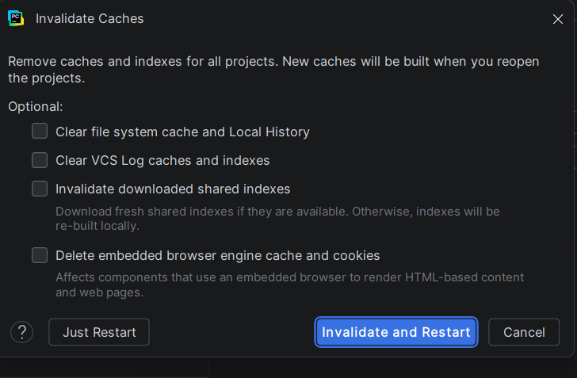

To permanently fix the broken refactor tracking without closing your tabs, clear the corrupted cache:

   1. Click File in the top menu.
   2. Select Cache Recovery (or Invalidate Caches...).
   3. Check the box for Clear file system cache and Local History.
   4. Click Invalidate and Restart.

## Quick Temporary Workaround
If you are in a rush and do not want to restart, press Ctrl + S (Save All) right before you refactor. This manually forces PyCharm to sync your open tabs with the hard drive, which often clears the conflict immediately.
Did the Cache Invalidation solve the issue for your subsequent renames?

