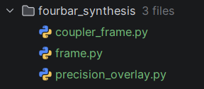
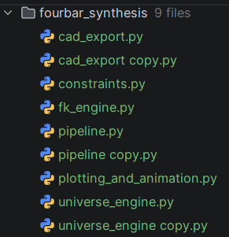

## 1. Import Cleanup & Scope Resolution

* **PyCharm Feature:** Optimize Imports.
* **Lenovo trick:** Press `Ctrl + Shft + A`  because `Ctrl + Alt + O` does not work natively.  (Common Lenova stuff)
* **Procedure:** Press `Ctrl + Alt + O` (Windows/Linux) or `Ctrl + Option + O` (macOS), or select **Code | Optimize Imports** from the top menu.
* **Target Code Elements:**
* Removes unused imports: `choose_by_continuity` and `export_motion_packet`.
* Consolidates inline imports (`from fourbar_synthesis...` inside functions like `coupler_point_path` and `animate_full_linkage`) to top-level statements.


* **Estimated Success Probability:** **98%** (PyCharm AST parser reliably identifies unused top-level symbols; manual verification required for conditional inline imports).

---

## 2. Global Data Scope Encapsulation (Extract Function)

* **PyCharm Feature:** Extract Function / Method.
* **Procedure:**
1. Highlight lines 22–38 (the `json.load` calls for `precision_task.json` and `atlas_seeds.json`).
2. Press `Ctrl + Alt + M` (Windows/Linux) or `Cmd + Option + M` (macOS), or select **Refactor | Extract/Introduce | Function**.
3. Name the function `load_design_inputs()`.


* **Target Code Elements:** Moves runtime I/O operations out of the top-level module scope to prevent implicit execution on import.
* **Estimated Success Probability:** **95%** (Variable scope analysis in PyCharm handles local-to-return mappings cleanly).

---

## 3. Extract Duplicate Logic Blocks

* **PyCharm Feature:** Extract Function / Method + Duplicate Detection.
* **Procedure:**
1. Highlight the recurring figure title/axis setup in `plot_coupler_path_with_precision`:
```python
if seed_index is not None:
    ax.set_title(...)
else:
    ax.set_title(...)

```


2. Press `Ctrl + Alt + M`. Name the function `configure_plot_axes(ax, a, b, c, AD, u, v, seed_index=None)`.
3. Accept PyCharm's prompt to automatically replace matching duplicate blocks in `animate_coupler_path` and `animate_full_linkage`.


* **Target Code Elements:** Unifies repeated Matplotlib canvas initialization across the 3 plotting functions.
* **Estimated Success Probability:** **90%** (PyCharm correctly identifies AST equivalence across functions if parameters match).

---

## 4. Module Decomposition (Move Symbol Refactoring)

* **PyCharm Feature:** Move Module Members.
* **Procedure:**
1. In the Project Tool Window (`Alt + 1`), create a new target file (e.g., `visualization.py`).
2. In `generate_universe.py`, place the caret on the function name `plot_coupler_path_with_precision`.
3. Press `F6` (or **Refactor | Move**).
4. Select `plot_coupler_path_with_precision`, `animate_coupler_path`, and `animate_full_linkage` in the dialog.
5. Set the destination path to `visualization.py` and click **Refactor**.


* **Target Code Elements:** Separates Matplotlib rendering code from kinematic atlas generation calculations.
* **Estimated Success Probability:** **98%** (PyCharm updates module import statements across all dependent files automatically).

---

## 5. Entry Point & CLI Separation

* **PyCharm Feature:** Context Action / Convert to `if __name__ == "__main__":` block.
* **Procedure:**
1. Highlight the interactive input logic (`pp_mode = int(input(...))`) inside `generate_multi_seed_atlas()`.
2. Press `Ctrl + Alt + M` to extract to `prompt_precision_mode()` or move CLI interactions into `if __name__ == "__main__":`.


* **Target Code Elements:** Decouples user input I/O from core synthesis pipeline loops to allow programmatic execution and unit testing via `pytest`.
* **Estimated Success Probability:** **92%** (Requires manual validation of variable propagation for fallback values like `pp_mode = 3`).

---

## 6. Code Style & PEP 8 Reformatting

* **PyCharm Feature:** Reformat Code & Inspection Cleanup.
* **Procedure:** Press `Ctrl + Alt + L` (Windows/Linux) or `Cmd + Option + L` (macOS), or select **Code | Reformat Code**.
* **Target Code Elements:** Corrects irregular line spacing, inline comment placements, trailing comments (`# march`), and blank lines according to PEP 8 standards.
* **Estimated Success Probability:** **99%** (Automated layout engine operates deterministically).

## Existing Copilot modules and methods that may or may not be junk

  

---

# What Claude's take is

Looking at this, the file is really three things smashed into one module: core kinematics/fitting logic, plotting/animation code, and a top-level driver script with an `input()` call. That's the natural fault line for the refactor, and it also happens to line up with a real bug worth fixing while you're in there.

**One thing to flag first:** in `precision_fit_error_for_seed`, `D = compute_ground_pivot_D(...)` and `cp_local = np.array([u, v])` are computed and never used — the function immediately calls `coupler_point_path`, which recomputes both internally. Dead code, and worth deleting during the move rather than dragging it along.

**Proposed split:**
- `fourbar_synthesis/coupler_path.py` — `coupler_point_path`, `precision_fit_error_for_seed` (pure computation, no matplotlib, no I/O)
- `fourbar_synthesis/visualization.py` — `plot_coupler_path_with_precision`, `animate_coupler_path`, `animate_full_linkage`, `precision_point_overlay_summary`
- `generate_universe.py` — stays as the thin driver: data loading, `generate_multi_seed_atlas`, `__main__`

This also isolates the `matplotlib` dependency to one file, which matters if you ever want to run the fitting logic headless (e.g., batch overnight sweeps without a display).A couple of extra notes worth acting on:

- **`generate_multi_seed_atlas` mixes concerns beyond just plotting** — it has an `input()` call for `pp_mode` right in the middle of the science. If you want this eventually runnable non-interactively (batch sweeps, CI, etc.), consider a follow-up refactor: `Extract Function` (Ctrl+Alt+M) on just the "collect pp_mode" block into a small `get_pp_mode()` helper, so the interactive bit is swappable for a CLI arg later without touching the atlas logic.
- **`animate_coupler_path` and `animate_full_linkage` duplicate the "find DESIGN_INDICES from theta*" block** almost verbatim. Once both live in `visualization.py`, that's a good `Extract Method` target — pull it into a shared `_design_indices(thetas, precision_fit_details)` helper. PyCharm will flag the duplication itself under Code → Locate Duplicates if you want it to point out exactly how much overlaps.

The F6 Move refactor is the right tool here specifically because your functions cross-call each other (`precision_fit_error_for_seed` → `coupler_point_path`, the animators → `fk_positions`/`choose_by_continuity`) — PyCharm rewrites both the import statements and the call sites correctly, which a manual cut-and-paste won't reliably do once you have more than one or two moves in flight.