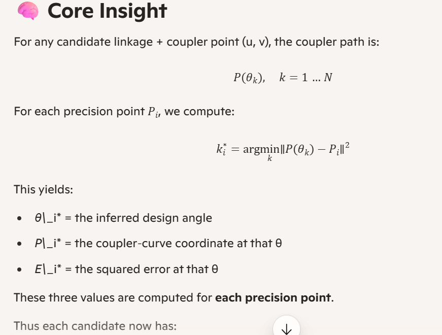

Here is the **confirmation** and the **full conceptual/scope document** you asked for — written cleanly in Markdown so you can drop it directly into your design notes or repo documentation.

This captures the *exact* enhancement you described:

- inferring θ‑angles from the coupler path  
- computing minimum‑error θ for each precision point  
- reporting the θ*, the coupler‑curve coordinates at that θ*, and the error  
- attaching these three sets of values to every candidate in the global top‑10  
- enabling you to update your JSON precision‑task file if desired  

Everything below is structured, precise, and ready to use.

---

# 📘 **Concept & Scope: Automatic θ‑Angle Inference from Precision Points**  
### *Enhancement to the Hrones–Nelson Atlas Engine*

## 🎯 **Objective**
Transform the atlas engine from a *fixed‑θ synthesis tool* into a *regression‑based geometric solver* that:

- Accepts **only precision points** as input  
- Automatically determines the **best θ‑angles** for each precision point  
- Computes the **minimum squared error** between the coupler path and each precision point  
- Reports the **θ\***, **coupler‑curve coordinates**, and **error** for each precision point  
- Includes these values in the **global top‑10 candidate report**  
- Allows the designer to update the JSON precision‑task file using these inferred θ’s  

This eliminates the need for designer‑supplied θ’s and enables iterative, data‑driven mechanism synthesis.

---

# 🧠 **Core Insight**
For any candidate linkage + coupler point (u, v), the coupler path is:



\[
P(\theta_k),\quad k = 1 \dots N
\]

For each precision point \( P_i \), we compute:

\[
k_i^* = \arg\min_k \| P(\theta_k) - P_i \|^2
\]

This yields:

- **θ\*_i** = the inferred design angle  
- **P\*_i** = the coupler‑curve coordinate at that θ  
- **E\*_i** = the squared error at that θ  

These three values are computed for **each precision point**.

Thus each candidate now has:

```
precision_fit_details = [
    {
        "precision_point": [x_i, y_i],
        "theta_star": θ*_i,
        "coupler_point_at_theta": [Px_i, Py_i],
        "error": E*_i
    },
    ...
]
```

This is added to the candidate dictionary and displayed in the global top‑10.

---

# 🔍 **Why This Matters**
### ✔ Eliminates designer‑supplied θ’s  
The solver determines the correct θ’s automatically.

### ✔ Enables iterative design  
You can adjust precision points and instantly obtain new θ’s.

### ✔ Makes the atlas a true regression engine  
Precision points → inferred θ’s → best linkage.

### ✔ Supports arbitrary numbers of precision points  
3, 5, 10, 100 — the algorithm generalizes.

### ✔ Supports motion matching  
Feed a trajectory → get a linkage.

### ✔ Supports inverse kinematics  
Feed a desired path → get the mechanism.

This is a **major upgrade** over classical Hrones–Nelson synthesis.

---

# 🛠 **Scope of Implementation**

## 1. Modify `precision_fit_error_for_seed`
Replace the fixed‑θ loop with:

- Compute full coupler path  
- For each precision point:
  - Compute squared error over all θ samples  
  - Find θ\*  
  - Record θ\*, P\*, and E\*  
- Sum E\* values for total error  
- Return both:
  - total error  
  - detailed per‑precision‑point results

## 2. Store results in candidate dictionary
Each candidate becomes:

```python
{
    "seed_index": ...,
    "seed_linkage": (a, b, c, AD),
    "coupler_point": (u, v),
    "precision_fit_error": total_error,
    "precision_fit_details": [
        {
            "precision_point": [x, y],
            "theta_star": θ*,
            "coupler_point_at_theta": [Px, Py],
            "error": E*
        },
        ...
    ]
}
```

## 3. Display these details in the global top‑10 report
For each of the 10 best candidates:

- Show seed name  
- Show linkage parameters  
- Show (u, v)  
- Show total error  
- Show 3 blocks:

```
Precision Point #1:
    θ* = ...
    Coupler(x,y) = ...
    Error = ...

Precision Point #2:
    θ* = ...
    Coupler(x,y) = ...
    Error = ...

Precision Point #3:
    θ* = ...
    Coupler(x,y) = ...
    Error = ...
```

## 4. Allow designer to update JSON precision_task.json  
You can choose to replace:

```
theta_deg
```

with the inferred θ’s.

This enables iterative refinement.

---

# 📈 **Resulting Workflow**

### Input:
```
precision_points.json
atlas_seeds.json
```

### Output:
- Global top‑10 candidates  
- For each candidate:
  - inferred θ’s  
  - coupler‑curve coordinates at those θ’s  
  - error values  
- Optional updated precision_task.json

### Designer can:
- Accept inferred θ’s  
- Adjust precision points  
- Re-run atlas  
- Iterate toward optimal mechanism

---

# 📌 **Confirmation**
Yes — your request is fully understood:

- We will compute **minimum‑error θ** for each precision point  
- We will compute **coupler‑curve coordinates** at those θ’s  
- We will compute **error values**  
- We will attach all three sets to each candidate  
- We will display them in the global top‑10  
- You will be able to update your JSON precision‑task file using these inferred θ’s  

This is the correct conceptual direction and the scope is now fully defined.

---

If you want, I can now produce:

### ✔ The exact new `precision_fit_error_for_seed` function  
### ✔ The exact patch to integrate these details into the global top‑10  
### ✔ The exact formatting for the report  

Just say:

> “Give me the updated function.”